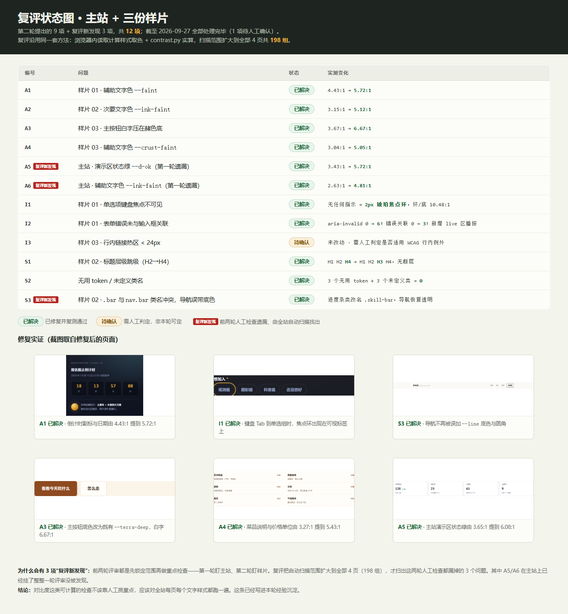

# 复评报告 · 主站 + 三份样片（2026-09-27）

> 这是增量复评，不是新一轮首评。沿用前两份报告的编号体系，只记录变化与新增。
> 对照基线：`web-design-review-2026-09-09.md`（第一轮·主站）+ `web-design-review-2026-09-27-samples.md`（第二轮·样片）。

## 复评结论

- 第二轮提出的 9 项全部处理完毕：**8 项已解决，1 项（I3）保留待人工确认**，理由见下。
- 复评过程中**新发现 3 项**（A5、A6、S3），全部已修复。其中 A5、A6 位于主站，**在第一轮评审的范围内却未被发现**。
- 修复后全站 4 页共 **198 组**「前景/背景/字号/字重」组合，**真实失败 0 组**（样片 03 有 2 组是半透明背景导致的已知假阳性，真实值 10.84:1 与 5.86:1）。
- 无回归：修复未破坏任何已有交互，四页均无 JS 报错、无横向溢出、无破损图片。

**本轮最重要的收获不是修好了几个色值，而是发现了一个方法论错误**：前两轮都是"先锁定范围、再做重点检查"，所以第一轮眼里只有主站、第二轮眼里只有样片。直到复评把自动扫描扩大到全部 4 页，才扫出这两轮人工检查都漏掉的 3 个问题。详见文末「方法学修正」。

---

## 变化总表

| 原编号 | 状态 | 复核结论 | 证据或剩余动作 |
|---|---|---|---|
| A1 | 已解决 | 样片 01 `--faint` `#6B7899` → `#7E8BAB` | 4.43:1 → **5.72:1**（表单深色底合成近似 4.88:1 亦通过） |
| A2 | 已解决 | 样片 02 `--ink-faint` `#8E8E82` → `#6B6B60` | 3.15:1 → **5.12:1**（白卡 5.39:1） |
| A3 | 已解决 | 样片 03 主按钮底色 `--terra` → 既有 `--terra-deep`，hover → `#7A3F1A` | 3.67:1 → **6.67:1**（hover 8.22:1）；导航 CTA、首屏按钮、底部行动区、`.today-tag` 四处一并覆盖 |
| A4 | 已解决 | 样片 03 `--crust-faint` `#9C8A78` → `#7A6550` | 3.04:1 → **5.05:1**（卡片 5.43:1） |
| I1 | 已解决 | 用 `:has(input:focus-visible)` 把焦点态透传到可视标签，并给不支持 `:has()` 的浏览器留 JS 回退 | 程序化 focus 与**真实键盘 Tab** 两种路径均实测：焦点环 `2px solid #F2B33D` 出现在标签上，环/底对比 **10.48:1** |
| I2 | 已解决 | 三个错误提示补 `id`，输入框补 `aria-describedby`，校验时切 `aria-invalid`；新增 `aria-live` 状态区 | `aria-invalid` 0 → **6**（3 字段 × 输入+选择）；`aria-describedby` 0 → **3**；`.err[id]` 0 → **3**；空提交播报"有 3 项需要补充"，成功播报"提交成功" |
| I3 | **未解决（有意保留）** | 门店页两处行内链接热区仍为 110×16 / 65×17 | 这两处是**行内文本链接**，可能适用 WCAG 2.2 的"行内例外"条款，属人工判断项，不宜由工具结论直接改版式。保留待确认。 |
| S1 | 已解决 | 样片 02 的「能力」标题由 `<h4>` 改为 `<h3 class="skills-title">`，样式改用 class 而非标签选择器 | 标题大纲 H1 H2 **H4** → H1 H2 **H3** H4，无断层；作品卡片内的 `h4` 层级正确，未一并改 |
| S2 | 已解决 | 删除 3 个未被引用的 token；补齐门店页未定义的 `.mono`；另清掉主站两个空的 no-op 类与两段失效 CSS | 静态扫描：4 页 token 未引用数 **0**，HTML 用到但 CSS 未定义的类 **0** |

---

## 复评新发现

### [A5 · P1 · 新增] 主站演示区状态绿 `--d-ok` 只有 3.43:1

- **标签**：无障碍·对比 / 视觉·色
- **置信度**：已确认
- **证据**：contrast.py：`hsl(142 72% 35%)` = `#199A48`，在 `.ds-badge` 的底色 `--d-ok-soft` = `#EEFBF4` 上 **3.43:1**；在白色卡片上作 `.ds-kpi b small`（"+12%"）时 **3.65:1**。两处均为 11px，阈值 4.5:1。
- **位置**：主站产品 UI 演示区——筛选项徽标「已录取」、KPI 卡的涨幅小字
- **现象**：绿色取自 `saas-product-ui-system` 的 `--d-*` token 体系，语义分组是对的（`--d-ok` / `--d-ok-soft`），但 35% 明度的绿在近白底上不够。
- **影响**：演示区是这一页用来证明"能做后台"的关键证据，徽标和涨幅恰是其中最该被看清的两个数字。
- **修改建议**：`--d-ok` 改为 **`#14713A`**——`#EEFBF4` 上 **5.72:1**、白底 **6.08:1**，两处均通过，且绿色仍足够鲜明。若要更稳可用 `#126634`（6.63:1 / 7.06:1，白底达 AAA）。不要动 `--d-ok-soft`，它只是浅底。
- **验证方法**：复测 4 页全量色对；另确认 `.dot.ok`（非文字状态圆点）加深后与相邻灰色圆点仍可区分。

### [A6 · P1 · 新增] 主站辅助文字色 `--ink-faint` 最低只有 2.63:1

- **标签**：无障碍·对比 / 视觉·色
- **置信度**：已确认
- **证据**：contrast.py：`#8A918A` 在 `--paper-deep #E7E9DC` 上 **2.63:1**、在 `--paper #F3F4EC` 上 **2.92:1**、在 `--card #FCFCF8` 上 **3.14:1**。全部低于 4.5:1。
- **位置**：`--ink-faint` 在主站的 16 处使用，字号集中在 **10–13px**：ticket 字段名（`dt`，12px）、`.mono-label`（11px）、服务卡 `.tag` 与 `.who`、素材区文件名与图注（10–12px）、工具箱 `.tool-use`（11px）、评审区图注与说明（12px）、页脚三行（10–13px）、联系区 `.cw-k` / `.cw-note` / `.wx-label` / `.wx-hint`（11–12.5px）
- **现象**：这是三页样片同类问题（A1/A2/A4）在主站上的同源版本——**同一个作者、同一种"次要文字就该更浅"的直觉，四次都取浅了**。第一轮主站评审只抽查了正文、强调色和深色区三组，恰好全部通过，于是这一整类没被看见。
- **影响**：16 处、且都是 10–13px 的小字。页脚、图注、字段名、联系区标签这些"没人会细看"的地方恰恰是客户核对信息时要读的。对比度 2.63:1 意味着在户外或低亮度屏幕上基本读不清。
- **修改建议**：
  1. `--ink-faint` 由 `#8A918A` 改为 **`#5F665F`**，四个背景全部通过：`#E7E9DC` 4.81:1、`#F3F4EC` 5.34:1、`#FCFCF8` 5.75:1、白 5.91:1。
  2. 不要只改用到它的那 16 处——改 token 本身，否则以后新增的地方还会踩同一个坑。
  3. 检查层次是否被压平：`--ink-soft #5C645D` 是 5.52:1 的正文色，改动后两者接近。实测后页脚与图注仍比正文轻（字号差 3–4px + 字重差），层级成立；若觉得糊，把 `--ink-soft` 再加深一档而不是把 `--ink-faint` 调回浅色。
- **验证方法**：全站复扫 198 组；再通读页脚、图注、ticket 字段三处，确认仍能一眼分出主次。

### [S3 · P2 · 新增] 样片 02 的 `.bar` 与 `nav.bar` 类名冲突，导航被误加底色

- **标签**：系统·Token / 视觉·质
- **置信度**：已确认
- **证据**：DOM 背景链实测——`.brand small` 的最近非透明背景是 `NAV.bar => rgb(224, 222, 213)`，即 `--line #E0DED5`。样式表里进度条规则 `.bar{height:3px;background:var(--line);border-radius:2px;overflow:hidden}` 同时匹配到类名为 `bar` 的导航元素 `<nav class="bar">`；`nav.bar` 规则只覆盖了 display / gap / height，没声明 `background`，于是进度条的底色漏到了整条导航上，同时 `border-radius:2px` 和 `overflow:hidden` 也一并生效。
- **位置**：样片 02 顶部导航整条
- **现象**：导航实际带着一层 `--line` 的暖灰底。因为颜色接近纸色、又被 `header.site` 的 `rgba(250,249,246,.9)` 叠了一层，肉眼不易察觉，但取色立即可见。
- **影响**：一是导航与页头出现两层不同底色，放大或调高对比时边界会显脏；二是 `overflow:hidden` 会裁掉超出导航盒的焦点环或下拉内容，属于埋着的隐患。这类"类名撞车导致规则互相污染"正是手写 CSS 最容易出的问题。
- **修改建议**：
  1. 进度条类改名为 `.skill-bar`（CSS 3 条规则 + 5 处 HTML + 1 处 JS 全量替换），导航保持 `nav.bar` 不动。
  2. 反向检查：主站没有 `.bar` 规则，只有 `nav.bar`，不受影响——但同类风险存在（如 `.field` 同时被用于 ticket 字段与表单字段），后续新增组件前缀化命名。
- **验证方法**：复测 `nav.bar` 的计算背景为透明；再确认技能条仍能滚动到位后填充（JS 选择器已同步改）。

---

## 修复后实测数据

y=0 为页面坐标，全部取自浏览器内 `getComputedStyle`（非截图取色），逐组跑 `review-ui-design/scripts/contrast.py`。

| 页面 | 色对组数 | 最低比值 | 未达标 |
|---|---|---|---|
| 主站 `index.html` | 90 | 4.55:1（`#6F7686`/白） | 0 |
| 样片 01 招新页 | 33 | 5.72:1（`#7E8BAB`/`#080C1A`） | 0 |
| 样片 02 作品集 | 28 | 5.12:1（`#6B6B60`/`#FAF9F6`） | 0 |
| 样片 03 门店页 | 47 | 5.05:1（`#7A6550`/`#FBF4E9`） | 2（均为已知假阳性，真实 10.84:1 / 5.86:1） |
| **合计** | **198** | — | **0（真实）** |

进程健康的其他指标：四页 JS 报错 0、失败请求 0、破损图片 0；桌面 1440px 与手机 390px 均无横向溢出（`scrollWidth == clientWidth`）。

---

## 保留的优势 / 副作用检查

- **无回归**：招新页倒计时仍按真实日期递减；作品集的类型筛选、就地展开、技能条填充正常；门店页"正在营业 / 20:30 关门"仍按本机时间计算，菜单分类切换正常（面包分类 6 项、轻食 4 项）；主站产品演示的空状态开关与筛选未受影响。
- **无新增失败请求**：联系方式改动只加了三处 `[data-copy]` 按钮与一个 `mailto:`，没有引入任何外部依赖。
- **样式层级未被压平**：`--ink-faint` 加深后，页脚/图注与正文仍保持可辨的主次差；样片 02 加深后，作品副标题与作品标题的层级反而更清楚。
- **样片的三套视觉语言未被破坏**：本轮只动色值与语义，没有改版式、字体或构图，三页之间"刻意不同"的策略保持不变。

---

## 待确认项

- **I3**：门店页两处行内链接是否适用 WCAG 2.2 的"行内例外"。需要人判断，工具给不了答案；若判定不适用，加 `padding:6px 2px; display:inline-block` 即可把热区抬到 28–29px（注意 `.strip` 是固定 38px 高，改前先确认不会撑高信息条）。
- 四页在**系统 200% 文字放大**下的重排表现。
- 真实读屏软件对招新页表单错误播报的朗读效果（本轮只验证了属性齐全，未做真人读屏测试）。
- 打字机式的小字号（10px）即便达到 4.5:1，在低分辨率屏幕上仍偏小——是否把 `.mono-label`、`.tag`、素材文件名统一抬到 11–12px，属版式判断，本轮未动。

---

## 方法学修正（本轮最大收获）

**问题**：前两轮评审都先锁定了检查范围——第一轮只看主站，第二轮只看三份样片。范围一锁，重点检查就只覆盖了各轮的"重点对象"，而对比度是一类**可以穷举计算**的检查，本不该靠人工挑重点。

**后果**：A5、A6 两个问题就挂在主站上，整整一轮评审没被发现；S3 在第二轮评审的三份样片里，也没被人工检查抓到（它是取色时顺带暴露的）。

**修正**：对比度这类可计算的检查，**对全站每一页、每一个文字样式都跑一遍**，不按"重点页面"抽样。人工评审的价值在于判断"这个色差是有意策略还是错误""这个间距别扭是不是业务需要"，而不是替代穷举扫描。

**已同步到本机技能**：`~/.codex/skills/review-ui-design/references/lessons.md` 与 `~/.codex/skills/frontend-design/references/lessons.md`。

## 可视化

