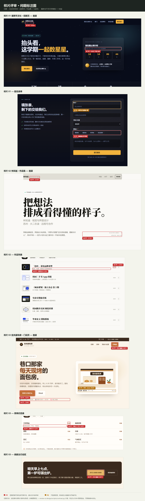
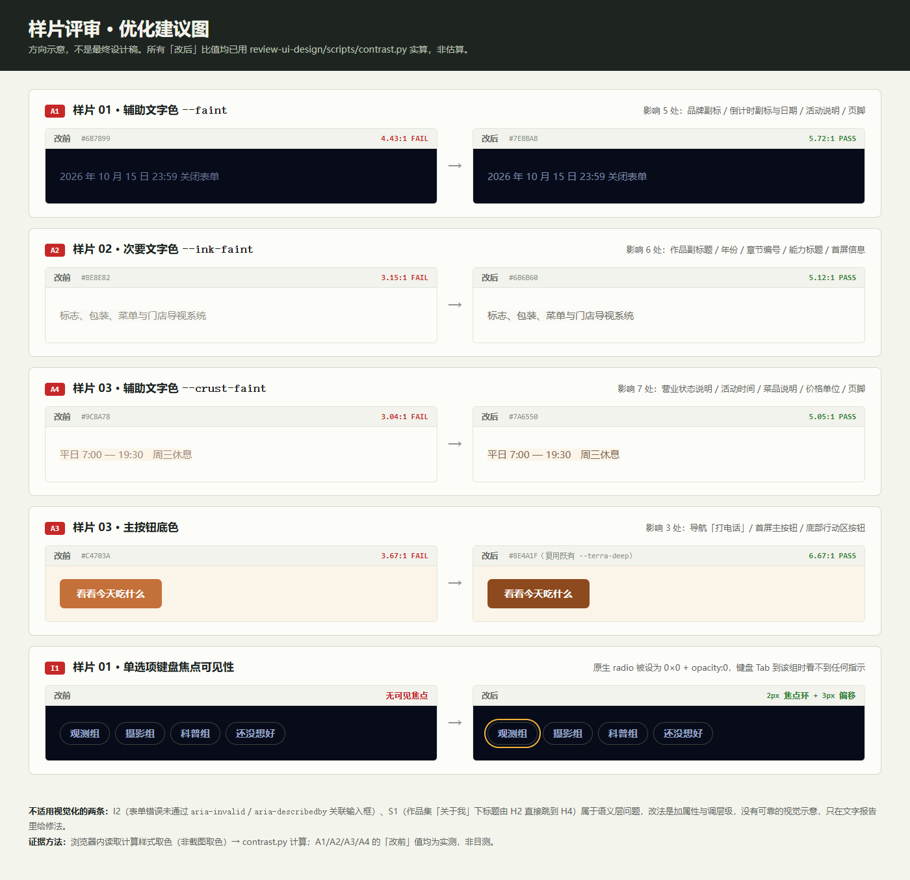

# 样片 UI 评审报告（2026-09-27 · 新基线）

> 对象：`works/` 下三份对外样片 —— 社团招新页、个人作品集、小店门店页。
> 与 2026-09-09 的主站评审报告**编号不共用**：本轮是新稿件、新基线，编号从 A1 / I1 / S1 重新开始。

## 设计评审结论

**总体判断**：三份样片的**结构**是合格的——三套视觉语言各自成立、都能一眼看出是给谁做的，而且每页都有一个真实在跑的交互。真正的瓶颈集中在**颜色 Token 的取值**上：三页各自都有一类"次要文字色"，取值偏浅，实测 3.04–4.43:1，达不到 AA 4.5:1。这不是三处孤立失误，而是同一个根因犯了三次，所以修起来也快——改 3 个变量值即可覆盖 18 处文字。

**评审范围**：三份样片的桌面端（1440px）+ 手机端（390px）；交互状态与无障碍属性做了程序化验证。

**关键假设**：三份样片是**独立演示稿**，服务不同的虚构客户，因此三者字体、色板、圆角不同属**有意策略**，不按"跨页一致性"扣分。以下只针对每页自身的目标与合规底线。

**证据限制**：

- 取色方式为浏览器内读取**计算样式**（比截图取色可靠，标为「已确认」）；但落在渐变或半透明叠加上的文字，其等效底色是按 alpha 合成的**近似值**，已在条目中标注。
- 未验证真实读屏软件朗读、系统 200% 文字放大、色弱模拟。
- 两处疑似问题经复核后**判定为假阳性并剔除**（见文末「剔除的假阳性」）。

**证据摘要**：

- 计算样式取色 109 组「前景 / 背景 / 字号 / 字重」组合，逐组跑 `review-ui-design/scripts/contrast.py`
- 可点击目标尺寸逐一测量（WCAG 2.2 24×24 CSS px）
- 对 12 个可交互元素逐个 `.focus()` 后比对 `outline / box-shadow / border-color` 计算值变化
- 检查表单错误关联属性：`aria-invalid` / `aria-describedby` / `.err[id]` 计数
- 提取标题大纲、`prefers-reduced-motion` 与 `:focus-visible` 支持、未引用 token 与未定义类名

---

## 值得保留

1. **三页各自都有完整的 token 系统，颜色按角色而非按位置组织。** 这是本轮最重要的一条优势：正因为 `--faint` / `--ink-faint` / `--crust-faint` 是语义变量而不是散落的色值，下面 18 处对比度问题才能靠改 3 行覆盖。没有这套结构，同样的错误要改 18 个地方。
2. **每页都有一个真实在跑的交互，不是静态排版。** 招新页倒计时按真实日期每秒递减（实测读数 `18:14:19:16`）、作品集筛选与就地展开、门店页「正在营业 / 20:30 关门」按本机时间计算（实测输出正确）。三页均无 JS 报错。
3. **可访问性的基础件在，不是完全没有。** 三页都实现了 `:focus-visible` 全局样式与 `prefers-reduced-motion` 降级；滚动揭示都带 1.2s 兜底全显 + `beforeprint`，所以打印和整页截图不会出现空白区。
4. **所有图形为矢量，无低质占位。** logo、面包插画、店面插画、地图示意、二维码占位全部是内联 SVG/CSS，放大不糊、无外链、无水印；破损图片数 0。

---

## 最优先修改

1. **[P1] 三页各有一个"次要文字色"达不到 AA，属同一根因犯了三次** —— 影响 18 处文字，观感上直接表现为"说明文字发虚、看着累"。把三页的 `--faint` / `--ink-faint` / `--crust-faint` 换成下面给出的实测通过值即可全部解决。
2. **[P1] 样片 03 的白字压在赭色底上只有 3.67:1，影响 3 个主操作** —— 主按钮、导航「打电话」、营业时间「今天」标签。**这与 2026-09-09 主站修过的「白字压在强调色上」是同一个根因**，说明上一轮的修复没有沉淀成跨页规则，才在新页面重犯。
3. **[P1] 样片 01 的单选项键盘焦点完全不可见** —— 键盘用户 Tab 到"想加入"这一组时，屏幕上没有任何指示，不知道自己停在哪。这是三页里唯一一个会**阻断操作**的问题。

---

## 可视化评审图

**问题标注图**（编号与下文一一对应，DOM 图层叠加，页面像素未改动）：

**优化建议图**（方向示意；所有「改后」比值均为 contrast.py 实算）：

---

## 问题与详细建议

### 一、视觉质量

#### [A1 · P1] 样片 01 辅助文字色 `--faint` 为 4.43:1，不达 AA

- **标签**：无障碍·对比 / 视觉·色
- **置信度**：已确认
- **证据**：计算样式取色 + contrast.py：`#6B7899` on `#080C1A` = **4.43:1**（阈值 4.5:1）
- **图中标记**：标注图第 1 面板（品牌副标、倒计时日期）
- **位置**：`--faint` 变量的全部 5 处使用——`.logo small`（9px）、`.count-card .label`（11px）、`.count-card .sub`（13px）、`.ev p` 活动说明（14px）、`.foot-note`（12px）
- **现象**：正文级字号使用了与背景亮度差不足的蓝灰色，比值差 0.07 未达阈值。
- **影响**：深色背景上的小字号本就吃亏，4.43:1 处于"看着能读、长时间读会累"的区间；对视力较弱或屏幕亮度低的使用者，这 5 处会成为页面上最先读不清的内容。
- **修改建议**：
  1. 最小改动：`--faint` 由 `#6B7899` 改为 **`#7E8BAB`**，实测 `#080C1A` 上 **5.72:1**，表单深色面板（合成底 `#1A1E2B` 近似）上 **4.88:1**，两处均通过。
  2. 若想同时摸到 AAA，用 **`#8B96B5`**（6.61:1），但会明显削弱"辅助文字"的层次感，需要同时把 `.lead` 一类正文再提亮，否则层级会挤在一起。
  3. 更彻底的做法：把 `--faint` 拆成语义更准确的两个变量——仅供 20px 以上的展示文字使用的浅色，与所有正文级小字使用的合规色。当前把两种角色塞进一个变量，是这次出错的根本原因。
- **验证方法**：改后重新取计算样式跑 contrast.py，确认 ≥4.5:1；再把整页转灰度看层级是否仍然成立（不要只看彩色的好看）。

---

#### [A2 · P1] 样片 02 次要文字色 `--ink-faint` 为 3.15:1，明显不足

- **标签**：无障碍·对比 / 视觉·色
- **置信度**：已确认
- **证据**：contrast.py：`#8E8E82` on `#FAF9F6` = **3.15:1**；on `#FFFFFF` = **3.31:1**（阈值 4.5:1）
- **图中标记**：标注图第 3、4 面板（首屏信息行、作品副标题与年份）
- **位置**：`--ink-faint` 的 6 处使用——`.brand small`、`.hero-meta`（12px）、`.work-head p` 作品副标题（14px）、`.work-meta .year`（13px）、`.sec-head .idx`（12px）、`.skills h4`（11px）
- **现象**：浅灰 `#8E8E82` 用在近白底上，明度差不足。注意 `.hero-meta` 在 24px 下按大号文字阈值 3:1 是**通过**的（3.15:1），失败的是所有 11–14px 的使用场合。
- **影响**：作品副标题是客户判断"这人做过什么"的关键信息，被试色压到近乎装饰；年份、章节编号同样失去可读性。这是三页里最严重的一组。
- **修改建议**：
  1. 为小字新增语义变量 `--ink-mute: #6B6B60`，把上述 5 处小字改用它——`#FAF9F6` 上 **5.12:1**、白卡上 **5.39:1**，均通过；`--ink-faint` 保留给 24px 以上的展示文字。
  2. 若不想加变量，直接整体加深 `--ink-faint` 到 `#6B6B60`，但首屏 `.hero-meta` 与 `.role` 会因此变重，需要同步下调字重或字号找回层次。
  3. 参考对照：`#75756A` 只有 4.42:1，**不要**选它——刚好差一点点，等于没修。
- **验证方法**：同上；另外把作品列表整体截图缩到 50% 对比一次，确认副标题仍可读。

---

#### [A3 · P1] 样片 03 白字压在赭色底上只有 3.67:1，影响 3 个主操作

- **标签**：无障碍·对比 / 视觉·色
- **置信度**：已确认
- **证据**：contrast.py：`#FFFFFF` on `#C4703A` = **3.67:1**（15px/600–700，不属大号文字，阈值 4.5:1）
- **图中标记**：标注图第 5、7 面板
- **位置**：三处同源——`.navlinks a.call`（导航「打电话」）、`.hero-actions .btn-primary`（首屏主按钮）、`.cta .btn-primary`（底部行动区按钮）；另有 `.today-tag`（11px/700）
- **现象**：品牌赭色 `#C4703A` 的明度偏高，白字放上去不够。
- **影响**：**这是页面上用户最该点的那三个按钮**，却是全页可读性最差的三处。门店页的核心任务就是"打电话订面包 / 看菜单"，主操作读不清直接损失转化。
- **修改建议**：
  1. 把主按钮底色由 `--terra #C4703A` 改为**既有的 `--terra-deep #8E4A1F`**，实测 **6.67:1**，通过——不需要引入新颜色，只是把已经定义好的深色用到正确的位置。
  2. hover 态相应改为 `#7A3F1A`，**8.22:1**，达到 AAA，且仍能看出按压层级。
  3. `--terra` 保留给描边、图标、下划线等**不承载文字**的装饰用途。
  4. **回归提醒**：本轮改动要同时检查 `.today-tag`（营业时间表里的「今天」标签），它用的是同一个底色。
- **验证方法**：改后对三个按钮逐一取色计算；再在手机亮度 50% 环境下目视确认。

---

#### [A4 · P1] 样片 03 辅助文字色 `--crust-faint` 为 3.04:1

- **标签**：无障碍·对比 / 视觉·色
- **置信度**：已确认
- **证据**：contrast.py：`#9C8A78` on `#FBF4E9` = **3.04:1**；on `#FFFDF9`（卡片底）= **3.27:1**（阈值 4.5:1）
- **图中标记**：标注图第 5、6 面板（首屏营业时间行、菜单说明与价格单位）
- **位置**：`--crust-faint` 的 7 处使用——`.logo small`、`.hero-note`（14px）、`.art-cap`、`.status span`（13px）、`.cake p`（13.5px）、`.mi .desc`（13.5px）、`.cake .price small`、`.map .muted`、`.foot-row`（13px）
- **现象**：暖灰 `#9C8A78` 在米色底上明度差不足，是本次三页里比值最低的一组。
- **影响**：菜单的菜品说明（"比利时黄油，27 层"）和价格单位（"/ 只"）都属于影响购买决策的信息，被压到接近装饰色。
- **修改建议**：
  1. `--crust-faint` 由 `#9C8A78` 改为 **`#7A6550`**，`#FBF4E9` 上 **5.05:1**、卡片 `#FFFDF9` 上 **5.43:1**，两处均通过。
  2. 若希望保留更轻的暖灰观感，可用 `#806B56`（4.63:1），通过但余量很小（0.13），不建议在会变动的背景上使用。
  3. 排查：`--line #E8DCC9` 与 `--wheat #E5B769` 是装饰色，**不要**被顺手一起加深，否则暖色体系会整体变脏。
- **验证方法**：改后用手机端 390px 视口重看菜单区，确认说明文字与菜品名的主次关系仍然清楚、没有变成同一种颜色。

---

### 二、交互体验

#### [I1 · P1] 样片 01 的单选项键盘焦点完全不可见

- **标签**：交互·状态 / 无障碍·键盘
- **置信度**：已确认
- **证据**：程序化验证——原生 `input[type=radio]` 的实际尺寸为 **0×0**、`opacity: 0`、`position: absolute`；对该组元素调用 `.focus()` 后，`outline / box-shadow / border-color` 计算值**无任何变化**。样式规则 `.radios input{position:absolute;opacity:0;width:0;height:0}` 把全局 `:focus-visible` 的焦点环画在了一个 0×0 的元素上。
- **图中标记**：标注图第 2 面板；建议图 I1 行
- **位置**：样片 01 报名表单「想加入」字段组，4 个选项
- **现象**：视觉上的选择状态（`.radios label:has(input:checked)` 的高亮）是正常的，但**键盘焦点**没有任何可见指示。
- **影响**：只能靠鼠标的用户不受影响，键盘用户（以及用读屏配合键盘的用户）Tab 进这一组后，无法判断焦点落在哪个选项上。修改建议里的"选一个吧，之后可以改"也帮不上忙。这是三页中唯一一个**阻断操作**的问题。
- **修改建议**：
  1. 最小改动：给可视的标签本体加焦点样式，而不是给隐藏的 input——`.radios label:has(input:focus-visible){outline:2px solid var(--amber);outline-offset:3px}`。用 `:has()` 把焦点状态"透传"到视觉层。
  2. 若需兼容不支持 `:has()` 的旧浏览器，改为「用 `clip-path` 或 `appearance:none` 保留 input 的可见尺寸并自行绘制」，而不是把它压成 0×0。
  3. 顺带检查：`.radios input` 被移出视觉流后，Tab 顺序是否仍与视觉顺序一致——目前 DOM 顺序与视觉顺序一致，这点没问题。
- **验证方法**：只按 Tab 键走完整张表单，确认每一步都能看到焦点位置；再确认按空格/方向键能切换选项。

---

#### [I2 · P2] 样片 01 的表单错误提示没有和输入框建立关联

- **标签**：交互·表单 / 无障碍·语义
- **置信度**：已确认
- **证据**：表单内 `[aria-invalid]` 计数 = **0**；`.err` 元素带 `id` 的计数 = **0**；`[aria-describedby]` 计数 = **0**。错误完全靠 CSS class 切换显示。
- **图中标记**：标注图第 2 面板
- **位置**：样片 01 表单的三个必填项（姓名 / 微信号 / 想加入）
- **现象**：空提交时红框与红字会正确出现（实测量：3 个字段被标为 invalid，且未误触发成功态），但这层信息只存在于视觉通道。
- **影响**：读屏用户提交后听不到"这个字段是必填的、现在为空"，只会觉得按钮没反应。视觉用户不受影响。
- **修改建议**：
  1. 给每个 `.err` 加 id（如 `err-name`），在对应 input 上加 `aria-describedby="err-name"`，并在校验失败时把 input 设为 `aria-invalid="true"`、成功时移除。
  2. 在表单顶部加一个 `aria-live="polite"` 的状态区，提交失败时写入"有 2 项需要补充"。
  3. 错误文案可以更具体：现在写的是"请填写姓名"，可改为说明格式要求（"请填写姓名，用于活动分组"）。
- **验证方法**：提交空表单，用读屏或无障碍树面板确认错误文本与输入框的关联关系成立。

---

#### [I3 · P2 · 待复核] 样片 03 两个行内链接的热区高度低于 24px

- **标签**：交互·控件 / 无障碍·目标尺寸
- **置信度**：待复核
- **证据**：实测 `.strip a`（"0512-0000 0000"）为 **110×16**，`.foot-row a`（"返回工具箱"）为 **65×17**
- **图中标记**：不适用（位置过于分散，单独标注会遮挡内容）
- **位置**：页首信息条的电话链接、页脚的返回链接
- **现象**：两处热区高度均小于 WCAG 2.2 的 24×24 CSS px。
- **影响**：手机上容易点偏。
- **但需复核**：WCAG 2.2 对"位于句子或文本流中的行内链接"设有**例外条款**，这两处严格来说都属于行内文本链接，可能**本来就符合规范**，不算缺陷。
- **修改建议**：
  1. 请人工确认这两处是否适用行内例外。若适用，本条可降级为"不改"。
  2. 若想稳妥：给它们加 `padding: 6px 2px` 并把 `display:inline-block`，把热区抬到 28–29px，视觉位置几乎不变。
  3. 注意 `.strip` 是 `height:38px` 的固定高度，加 padding 前要先确认不会撑高信息条。
- **验证方法**：真机手指点按 5 次，统计是否有点不中的情况。

---

### 三、设计系统

> 三份样片是**独立的演示稿**、服务不同的虚构品牌，因此色板、字体、圆角不同属有意设计。本节只检查各自内部的系统性，以及三份共有的维护性问题。

#### [S1 · P2] 样片 02 的标题层级跳级

- **标签**：系统·语义 / 无障碍·结构
- **置信度**：已确认
- **证据**：标题大纲提取结果——`H2:关于我 > H4:能力`，中间缺 H3
- **图中标记**：不适用（语义层问题，无对应视觉位置）
- **位置**：样片 02「关于我」区块中的「能力」标题
- **现象**：该区块从 H2 直接跳到 H4。原因是 `.skills h4` 复用了作品卡片内部 `h4` 的样式角色，但它在文档结构里位于另一个 H2 之下。
- **影响**：读屏用户靠标题层级跳转时会得到断层的导航结构；对纯视觉使用者无影响。
- **修改建议**：
  1. 把 `.skills h4` 改为 `<h3>`，然后用 class 而非标签选择器控制样式（`class="skills-title"`），让视觉不变、层级正确。
  2. 顺带核对 `.work-body` 内的 `h4`（我的角色 / 做了什么 / 难点）——它们处在每个 `h3` 作品标题之下，层级**正确**，不要一起改。
- **验证方法**：改后重新导出标题大纲，确认从 H1 到最深一级没有断层。

---

#### [S2 · P2] 三页共有的维护性问题：无用 token 与未定义类名

- **标签**：系统·Token / 系统·组件
- **置信度**：已确认
- **证据**：静态扫描——样片 01 定义 13 个 token 其中 `--amber-deep` 从未被 `var()` 引用；样片 02 定义 12 个其中 `--blue-soft` 未被引用；样片 03 在 HTML 中使用了 `class="mono"` 但 CSS 里**从未定义** `.mono`
- **图中标记**：标注图第 5 面板（`S2` 标在 `.art-cap` 的 `NO.01` 上）
- **位置**：三份样片的 `:root` 与门店页首屏插画说明栏
- **现象**：门店页首屏右下角的 `NO.01` 本意是等宽字体的编号，但因为 `.mono` 没有定义，它实际上继承了正文样式。
- **影响**：不影响使用，但会让后续维护者误以为该样式已存在；无用 token 会让"这套色板到底用了几种颜色"变得不可靠。
- **修改建议**：
  1. 门店页：在 CSS 里补上 `.mono{font-family:var(--mono);font-size:11px;letter-spacing:.06em;color:var(--crust-faint)}`，让 `NO.01` 生效；注意颜色一并按 A4 的新值走。
  2. 删除样片 01 的 `--amber-deep`、样片 02 的 `--blue-soft`；若日后需要，再从色板补。
  3. 更长期：把三页共用的基础件（滚动揭示、`sample-badge` 徽章、表单校验）抽成一份共享片段，三页各引一份。目前三处实现抄了三遍，`IntersectionObserver` 的阈值一个写 0.04 一个写 0.05。
- **验证方法**：重新扫描确认 HTML 中出现的 class 都能在 CSS 找到定义、`:root` 里的 token 都有引用。

---

## 30 分钟快速优化

按执行顺序，全部是低风险动作：

1. 改样片 01 的 `--faint: #6B7899` → `#7E8BAB`。
2. 改样片 02 新增 `--ink-mute: #6B6B60` 并把 5 处小字切过去（或整体加深 `--ink-faint`）。
3. 改样片 03 的 `--crust-faint: #9C8A78` → `#7A6550`。
4. 改样片 03 的主按钮底色：`--terra` → `--terra-deep`，hover → `#7A3F1A`；**别忘 `.today-tag`**。
5. 给样片 01 的 `.radios label:has(input:focus-visible)` 加 2px 焦点环。
6. 给样片 03 补上 `.mono` 的定义。

前 5 条改完，三页的对比度与键盘可操作性即全部达到 AA。

---

## 剔除的假阳性（记录以示证据纪律）

自动扫描初筛出两组"疑似失败"，复核后确认是**测量方法造成的假阳性**，不计入问题：

| 疑似项 | 表面比值 | 复核结论 |
|---|---|---|
| 样片 03 `.sample-badge` 文字 `#EFE3D2` on 米色 | 1.16:1 | 假阳性。徽章实际底色是 `rgba(58,42,30,.9)`，半透明导致取色脚本向上回退到了页面底色。按真实合成底 `#3A2A1E` 计算为 **10.84:1**，通过 |
| 样片 03 徽章强调字 `#E5B769` on 米色 | 1.70:1 | 同上。按合成底 `#4A3A2B` 计算为 **5.86:1**，通过 |
| 样片 02 `.brand small` on `#E0DED5` | 2.46:1 | 假阳性，同样源于 `header` 的半透明底 `rgba(250,249,246,.9)`。按真实底色 3.15:1 仍需修，已并入 A2，不单列 |

**结论**：对比度类问题不能只看自动扫描结果，半透明背景必须先做 alpha 合成再判定，否则会产出大量误报、也会漏掉真实问题。

---

## 待确认项

- 三页在**系统 200% 文字放大**下的重排表现（本次只验证了 390px 视口，未模拟文字放大）。
- 真实读屏软件对样片 01 表单错误提示的朗读效果（需人工验证，本轮只验证了属性缺失）。
- 样片 03 两处行内链接是否适用 WCAG 2.2 的"行内例外"条款（见 I3）。
- `:has()` 选择器在不支持的老版本浏览器下的降级表现（样片 01 的选择态依赖它）。
- 三页共用的滚动揭示实现抄了三遍，是否值得抽成共享片段（见 S2 第 3 条）。
